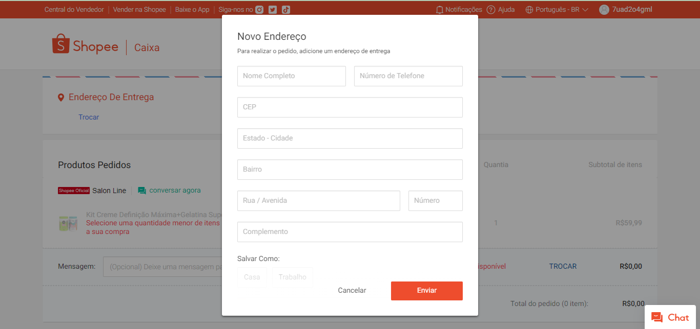
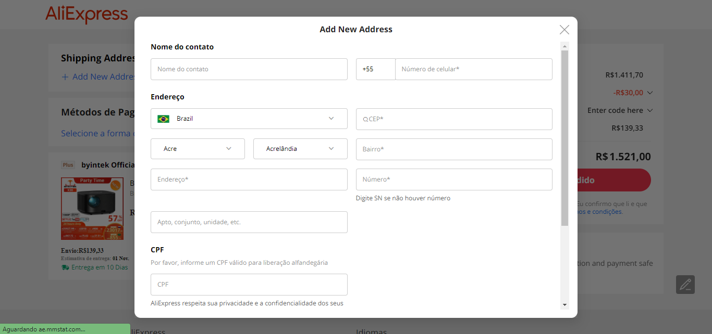
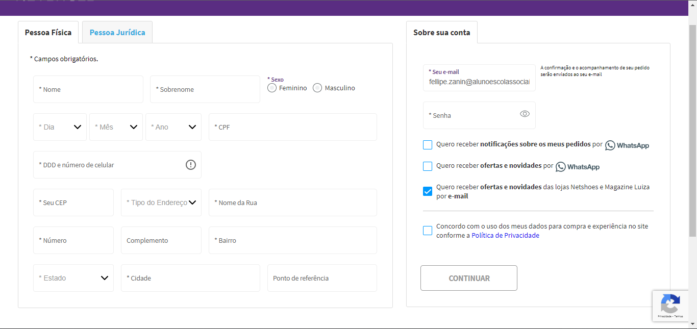
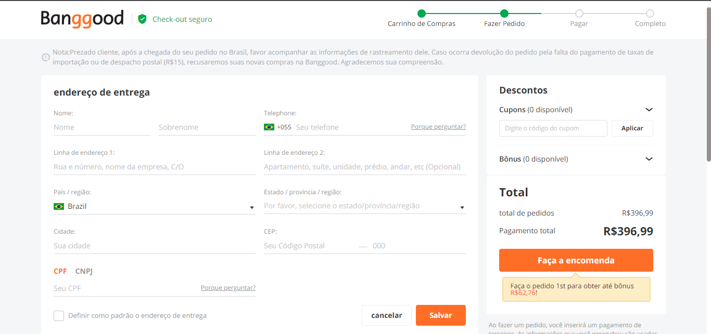

# Formulário de Cadastro
## Índice 
* [Descrição](#descrição-do-projeto)
* [Funcionalidade](#funcionalidade)
* [Técnicas e tecnologias utilizadas](#técnicas-e-tecnologias-utilizadas)
* [Fontes Consultadas](#fontes-consultadas)
* [Analise dos sites](#analise-dos-sites)
* [Shopee](#shopee)
* [AliExpress](#aliexpress)
* [Netshoes](#netshoes)
* [Banggood](#banggood)
* [Autores](#autores)
## Descrição
## Funcionalidade 
## Técnicas e tecnologias utilizadas
## Fontes consultadas 

# Analise dos Sites:
## Shopee:
### Descrição dos campos 
Para que o cadastro se iniciasse foi solicitado o número de celular, e-mail ou Facebook (rede social), no caso da captura de tela feita para o trabalho eu escolhi fazer com número de celular. Logo após foi enviado um código de verificação do número em meu WhatsApp. Após essa etapa precisei definir uma senha que deveria conter pelo menos um caractere minúsculo, pelo menos um caractere maiúsculo, 8-16 caracteres, apenas letras, números e pontuação poderiam ser utilizados. Com isso, o cadastro foi efetuado. Na primeira compra houve a necessidade de efetuar cadastro de endereço, que será usado para saber onde deverá ser enviado a encomenda, foi solicitado: o nome completo do usuário, algum número de contato caso seja necessário, o CEP q será usado como maneira de agilizar o cadastro, caso o CEP seja inserido corretamente, automaticamente o site buscará as seguintes informações: estado e cidade, bairro e a rua, é necessário que o usuário insira ele mesmo o número do local, se o CEP não for inserido/ for inserido incorretamente, o usuário terá que inserir as informações manualmente. após todos os dados sobre o local for situado, o site pede que informe se o local se trata de algum apartamento, ou casa. Foi necessário efetuar um cadastro pessoal, que pedia data de nascimento, e-mail, nome completo, gênero e cpf.

## AliExpress:
### Descrição dos campos 
Para que o cadastro se iniciasse foi solicitado a localização do usuário, e-mail e senha. Logo após foi enviado um código de 4 dígitos para a verificação do e-mail. Após essa etapa precisei digitar o CPF que seria utilizado na conta (não poderia ser o CPF de um menor de idade). Depois de digitar um CPF válido, o cadastro já estava efetuado, mesmo assim foi pedido o DDD e número de telefone. Na primeira compra houve a necessidade de efetuar cadastro de endereço, que será usado para saber onde deverá ser enviado a encomenda, foi solicitado: o nome de contato do usuário, algum número de celular para caso de que o contato caso seja necessário, o CEP q será usado como maneira de agilizar o cadastro, caso o CEP seja inserido corretamente, automaticamente o site buscará as seguintes informações: estado e cidade, bairro, rua e número de residência, se o CEP não for inserido/ for inserido incorretamente, o usuário terá que inserir as informações manualmente. após todos os dados sobre o local for situado, o site pede que informe se o local se trata de algum apartamento, ou casa. E novamente o site pede o CPF.

## Netshoes:
### Descrição dos campos 
O site mais diferente sem sombra de dúvidas foi o da Netshoes. O site tinha um cadastro simples que era feito somente uma vez, sem necessidade de que na primeira compra houvesse um cadastro de endereço. Havia dois tipos de cadastro, um para pessoa física e o outro para pessoa jurídica. Os dois tipos de cadastros pediam e-mail e senha. Para que o cadastro da pessoa física fosse efetuado foi necessário do nome completo. Dia, mês e ano em que nasceu, CPF, DDD e número de celular. Para que o cadastro de pessoa jurídica fosse efetuado, era necessário a inserção de Razão Social, Nome Fantasia e CNPJ da empresa. A inscrição social não era um campo obrigatório, porém a inscrição estadual era. DDD e número de celular corporativo e DDD e número fixo corporativo (como não é tão comum hoje em dia, o campo não é obrigatório). O cadastro de endereço era igual nos dois tipos de cadastro pedindo o CEP (caso o CEP for inserido corretamente, o próprio site irá consultar e preencher os outros campos) manualmente é necessário o tipo de endereço (casa, condomínio etc.) nome da rua, número, bairro, estado e cidade. Caso fosse entendido como necessário pelo usuário, ele tinha a opção de inserir complementos e ponto de referência.

## Banggood:
### Descrição dos campos
Sem sombra de dúvidas, o cadastro desse site era o mais confuso. Para que o cadastro se iniciasse foi solicitado um e-mail e senha e a concordância do usuário com os termos de uso e a política de privacidade. Na primeira compra houve a necessidade de efetuar cadastro de endereço, que será usado para saber onde deverá ser enviado a encomenda, foi solicitado: o nome e sobrenome do usuário, algum número de celular para caso de que o contato caso seja necessário. Depois disso a primeira lista de endereço que deveria conter: Rua e número, nome da empresa, C/O, e a segunda lista de endereço que deveria conter os complementos da residência sendo um campo opcional a ser preenchido. Depois disso, era necessário informar o país, estado/província/região, cidade e CEP. Depois disso informar o CPF ou CNPJ. E assim, o cadastro será concluído e salvo.

## Autores 
