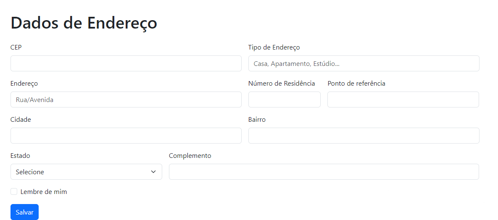

# Formulário de Cadastro
## Índice 
* [Descrição](#descrição)
* [Introdução](#introdução)
* [Funcionalidades](#funcionalidades)
* [Técnicas e tecnologias utilizadas](#técnicas-e-tecnologias-utilizadas)
* [Fontes Consultadas](#fontes-consultadas)
* [Analise dos sites](#analise-dos-sites)

## Descrição
O site é separado em três partes: 

Cadastro simples:
- O cadastro simples é o primeiro passo para começar a comprar no nosso site. Com ele, você poderá criar uma conta e fazer login para realizar compras, acompanhar seus pedidos e receber notificações sobre novidades e promoções.

* Para se cadastrar, basta informar seu e-mail, número de telefone e senha. Concordar com os termos de uso e com a política de privacidade são partes essenciais.

Cadastro pessoal:
- O cadastro pessoal é opcional. Com ele, você poderá cadastrar seus dados pessoais, como data de nascimento, gênero e domumentos.

* Essas informações são usadas para melhorar a sua experiência de compra, como por exemplo:

- ``Personalizar o envio de e-mails e notificações;``
- ``Oferecer recomendações de produtos;``
- ``Facilitar a troca ou devolução de produtos.``

Cadastro de endereço:
- O cadastro de endereço é necessário para que você possa receber seus pedidos. Você pode cadastrar quantos endereços quiser, como por exemplo o seu endereço residencial, o endereço do trabalho ou o endereço de um amigo ou familiar.

* Para cadastrar um endereço, basta informar o nome do destinatário, o endereço completo, o CEP e um ponto de referência.

## Introdução 
Passo a passo para se cadastrar:

- Acesse o link no "About"
- Preencha os campos do cadastro simples.
- (Opcional) Preencha os campos do cadastro pessoal.
- (Opcional) Cadastre um endereço.
- Clique no botão "Salvar".

Dicas para criar uma senha forte:
- Sua senha deve ter pelo menos 8 caracteres.
- Sua senha deve conter letras maiúsculas e minúsculas, números e símbolos.
- Não use senhas que sejam fáceis de adivinhar, como seu nome, data de nascimento ou endereço.

## Funcionalidades
**Cadastro simples**

O cadastro simples é um formulário básico que permite ao usuário criar uma conta no site de e-commerce. Ele inclui os seguintes campos:

* **E-mail:** Endereço de e-mail do usuário.
* **DDD e número de celular:** Número do aparelho telefonico do usuário. 
* **Senha:** Senha de acesso do usuário.
* Ao preencher o cadastro simples, o usuário poderá navegar pelo site livremente, mas não poderá realizar compras.

**Cadastro pessoal**

O cadastro pessoal é um formulário mais completo que permite ao usuário fornecer informações adicionais sobre si mesmo. Ele inclui os seguintes campos:

* **Nome:** Nome completo do usuário.
* **CPF:** O Cadastro de Pessoa Física do usuário.
* **RG:** Registro Geral do usuário.
* **Sexo:** Sexo do usuário.
* **Data de nascimento:** Data de nascimento do usuário.

* Ao preencher o cadastro pessoal, o usuário terá acesso a todas as funcionalidades do site de e-commerce, incluindo o histórico de pedidos e a lista de desejos.

**Cadastro de endereço**

O cadastro de endereço permite ao usuário adicionar endereços para entrega de produtos. Ele inclui os seguintes campos:

* **Bairro:** Bairro do destinatário.
* **Endereço:** Endereço do destinatário.
* **Cidade:** Cidade do destinatário.
* **Estado:** Estado do destinatário.
* **CEP:** CEP do destinatário.
* **Tipo de endereço:** Tipo de endereço do destinatário.
* **Complemento:** complemento caso necessário, sobre o endereço do destinatário.
* **Ponto de referência:** Ponto de referência do local em que será o destinatário.

Ao adicionar endereços de entrega, o usuário poderá escolher o endereço de destino ao finalizar uma compra.

**Funcionalidades adicionais**

Além dessas três partes principais, o site de e-commerce também pode incluir as seguintes funcionalidades de cadastro:

* **Cadastro de empresa:** Permite ao usuário criar uma conta para uma empresa.
* **Cadastro de revendedor:** Permite ao usuário criar uma conta para revender produtos do site.
* **Cadastro de associação:** Permite ao usuário criar uma conta para se associar a um programa de benefícios.

A escolha das funcionalidades de cadastro a serem implementadas em um site de e-commerce depende das necessidades do negócio e do público-alvo.

## Técnicas e tecnologias utilizadas
* ``HTML5``
* ``CSS3``
* ``VsCode``
* ``Git``
* ``GitHub``
* ``Bootstrap v5.0``
* ``Bard``

## Fontes consultadas 
* [Alura - Como escrever um bom README.md](https://www.alura.com.br/artigos/escrever-bom-readme)
* [Bootstrap](https://getbootstrap.com/docs/5.3/forms/checks-radios/#radios)
* [Alura - Tipos de type](https://cursos.alura.com.br/forum/topico-type-do-campo-telefone-104370)

# Analise dos Sites:
**Conclusão a partir de todas as analises de sites:**

1. Nos sites AliExpress e Shopee, não é necessário marcar algo para concordar com as políticas de privacidade e termos de uso. Já nos sites Netshoes e Banggood é necessário concordar marcando um botão, o que de certa forma deixa mais explícito;

2. A Shopee e o AliExpress tiveram uma etapa de verificação (a shopee do número de celular e o aliexpress do e-mail);

3. O cadastro da Netshoes foi o mais simples, compacto e que levou menos tempo para ser efetuado;

4. O cadastro da Shopee foi o único que não pediu a localização (só pediu no cadastro de endereço obviamente);

5. O AliExpress foi o único site que não aprovou a conta em um CPF de um menor de 18 anos, e o mais demorado para ser concluído.

6. O site da Netshoes foi o único que apresentou um campo como “tipo de residência”, enquanto os outros sites deixavam para que o tipo de endereço fosse colocado opcionalmente no campo de complementos.

7. O site da Netshoes era o único que tinha CAPTCHA (um teste de desafio cognitivo, utilizado como ferramenta antispam)

*As analises detalhadas estarão logo a baixo*
## Shopee:
**Descrição dos campos**
- Para iniciar o cadastro, é preciso fornecer um número de celular, e-mail ou usar o Facebook como opções de registro. Na captura de tela que escolhi para o trabalho, optei por usar o número de celular. Posteriormente, recebi um código de verificação no WhatsApp. Em seguida, tive que criar uma senha com requisitos específicos: pelo menos um caractere minúsculo, um caractere maiúsculo e um comprimento de 8 a 16 caracteres, permitindo apenas letras, números e pontuação.

- Após concluir o registro, na primeira compra, foi necessário fornecer informações de endereço. Solicitaram meu nome completo, um número de contato opcional, e o CEP, que foi usado para acelerar o preenchimento. Se o CEP fosse inserido corretamente, o site buscaria automaticamente o estado, cidade, bairro e rua. No entanto, o número do local precisava ser inserido manualmente caso o CEP fosse inserido incorretamente ou não fosse inserido. Além disso, era necessário especificar se o endereço era de um apartamento ou casa.

- Finalmente, foi necessário preencher um cadastro pessoal, incluindo data de nascimento, e-mail, nome completo, gênero e CPF.

## AliExpress:
**Descrição dos campos** 
- O cadastro começou com a solicitação da localização do usuário, e-mail e senha. Em seguida, foi enviado um código de 4 dígitos para verificar o e-mail. Depois, foi necessário inserir um CPF válido, com a restrição de que não poderia ser de um menor de idade. Após inserir o CPF, o cadastro estava concluído, mas também foi solicitado o DDD e número de telefone.

- Na primeira compra, foi necessário fornecer informações de endereço para entrega. Isso incluiu o nome de contato do usuário, um número de celular para contato, o CEP, que agilizaria o processo de preenchimento. Se o CEP estivesse correto, o site preencheria automaticamente o estado, cidade, bairro, rua e número da residência. Caso o CEP estivesse incorreto, o usuário teria que inserir essas informações manualmente. Além disso, foi necessário indicar se o local de entrega era um apartamento ou casa. Novamente, o site solicitou o CPF.

## Netshoes:
**Descrição dos campos** 
- O site da Netshoes se destacou por ter um processo de cadastro simples e único, eliminando a necessidade de fornecer informações de endereço durante a primeira compra. Existiam dois tipos de cadastros: um para pessoa física e outro para pessoa jurídica.

- Para o cadastro de pessoa física, eram solicitados nome completo, data de nascimento, CPF, DDD e número de celular. No cadastro de pessoa jurídica, era necessário fornecer Razão Social, Nome Fantasia e CNPJ da empresa. A Inscrição Social não era obrigatória, mas a Inscrição Estadual era necessária. Também havia campos para DDD e número de celular corporativo e DDD e número de telefone fixo corporativo, este último sendo opcional.

- O cadastro de endereço era semelhante para ambos os tipos de cadastro, requerendo o fornecimento do CEP (com preenchimento automático dos campos se o CEP fosse inserido corretamente). Além disso, era necessário especificar o tipo de endereço (casa, condomínio, etc.), nome da rua, número, bairro, estado e cidade. Os usuários tinham a opção de adicionar complementos e ponto de referência, se desejado.

## Banggood:
**Descrição dos campos**
- O cadastro neste site se mostrou confuso. Para começar o cadastro, o usuário precisava fornecer um e-mail, senha e concordar com os termos de uso e política de privacidade. Na primeira compra, o processo de registro de endereço incluía o nome e sobrenome do usuário, um número de celular para contato, duas listas de endereço. A primeira lista pedia a rua e número, nome da empresa, C/O (caso aplicável), e a segunda lista solicitava complementos da residência, sendo um campo opcional.

- Além disso, o usuário tinha que fornecer informações sobre o país, estado/província/região, cidade e CEP. Por fim, era necessário informar o CPF ou CNPJ. Com isso, o cadastro era concluído e salvo.

## Autor(a)
|  [ Ana Santos](https://github.com/AnaLu1za) |  
| :---: |